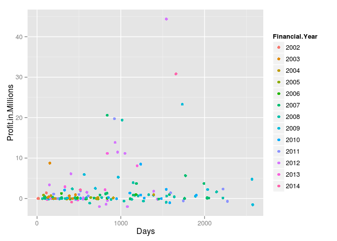
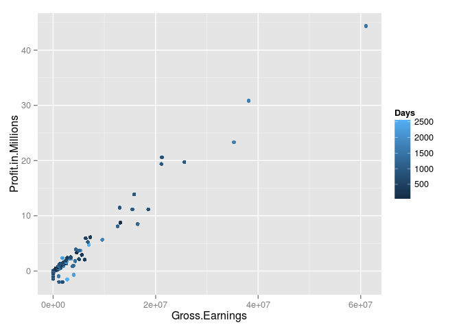
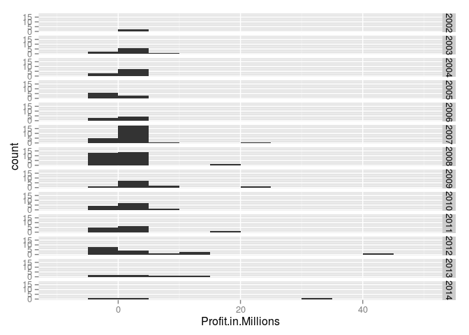
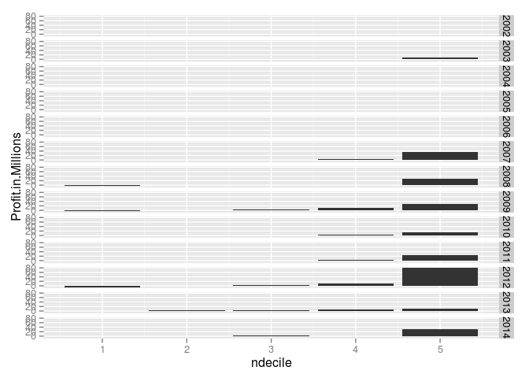

# ReviewData
Kate Davis  
08/05/2014  


```r
options(stringsAsFactors=F)
#require(plyr)
df=read.csv("20140805_Raw_Data.csv",stringsAsFactors=F)
df$Profit.in.Millions=df$Profit/1e6

df=(df[order(df$Profit.in.Millions),])
df$Opening.Date=as.Date(df$Opening.Date,"%d-%b-%y")
df$Withdrawl.Date=as.Date(df$Withdrawl.Date,"%d-%b-%y")
df$Financial.Year=factor(df$Financial.Year,levels=sort(unique(df$Financial.Year)))
#qq=quantile(log(abs(df$Profit.in.Millions)),seq(0,1,0.2),names=T,type=7)
#df$decile=with(df,cut(log(abs(Profit.in.Millions)), breaks = qq,labels=names(qq)[1:(length(qq)-1)] ,include.lowest = T))
#epm=tapply(df$Profit.in.Millions,df$Financial.Year,ecdf)
qf<-function(vec){quantile(((vec)),seq(0,1,0.2),names=T,type=7)}
dec=tapply(df$Profit.in.Millions,df$Financial.Year,qf)
df$ndecile=NA
for (l in 1:length(dec)){
  qq=dec[[l]]
  labs=names(dec[[l]])[1:(length(qq)-1)]
  yr=names(dec)[l]
  
  tdf=cut(((df$Profit.in.Millions)), breaks = qq,labels=labs ,include.lowest = T)
  df$ndecile[df$Financial.Year==yr]=tdf[df$Financial.Year==yr]
}
df$ndecile=as.numeric(df$ndecile)
df$decile=as.character(as.numeric(df$ndecile)*20)
#df$ndecile=as.numeric(sub("%","",df$decile))/100
# no df$decile[negs]=paste0("-",df$decile[negs])
# No df$ndecile[negs]=(-1*df$ndecile[negs])
#qq=quantile(log(-1*df$Profit.in.Millions[negs]),seq(0,1,0.1),names=T,type=7)
#df$decile[negs]=with(df,cut(log(-1*Profit.in.Millions[negs]), breaks = qq,labels=paste0("-",names(qq)[2:11]), include.lowest = T))
str(df)
```

```
## 'data.frame':	151 obs. of  13 variables:
##  $ No                : int  150 126 65 153 60 94 93 165 127 83 ...
##  $ Opening.Date      : Date, format: "2010-05-04" "2008-11-17" ...
##  $ Withdrawl.Date    : Date, format: "2012-05-18" "2011-11-01" ...
##  $ Days              : int  745 1079 2576 824 629 1584 1542 413 2275 1038 ...
##  $ Financial.Year    : Factor w/ 13 levels "2002","2003",..: 11 11 8 11 7 9 7 13 10 7 ...
##  $ Earnings.Type     : chr  "S" "W" "W" "WD" ...
##  $ Gross.Earnings    : num  1802749 1161271 2756650 0 0 ...
##  $ Profit            : num  -2012158 -1967031 -1533211 -1411579 -1151500 ...
##  $ Cut.Start         : num  -1533000 -1533000 -1533000 -1000000 -1000000 ...
##  $ Cut.End           : num  -2012000 -2012000 -2012000 -1500000 -1500000 ...
##  $ Profit.in.Millions: num  -2.01 -1.97 -1.53 -1.41 -1.15 ...
##  $ ndecile           : num  1 1 1 1 1 1 1 1 1 1 ...
##  $ decile            : chr  "20" "20" "20" "20" ...
```

Let's see what we have, scatterplots first


```r
require(ggplot2)
```

```
## Loading required package: ggplot2
```

```r
require(scales)
```

```
## Loading required package: scales
```

```r
gscat=ggplot(df,aes(x=Days,y=Profit.in.Millions,color=Financial.Year))+geom_point()
print(gscat)
```

 

```r
gscat=ggplot(df,aes(x=Gross.Earnings,y=Profit.in.Millions,color=Days))+geom_point()
print(gscat)
```

 


```r
ghist=ggplot(df,aes(x=Profit.in.Millions)) + geom_histogram(binwidth=5)+facet_grid(Financial.Year~.)
print(ghist)
```

 


```r
df2=(df[order(df$Financial.Year,df$Profit.in.Millions),])
negs=(df2$Profit.in.Millions<=0)
require(scales)
reds=sprintf("%02x",ceiling(rescale(df2$ndecile[negs],to=c(0,255))))
grey=sprintf("%02x",floor(rev(rescale(log(df2$ndecile[!negs]),to=c(0,255)))))
df2$hr=""
df2$hg=""
df2$hb=""
df2$hr[negs]="FF"
df2$hg[negs]=reds
df2$hb[negs]=reds
df2$hr[!negs]=grey
df2$hg[!negs]="FF"
df2$hb[!negs]=grey
df2$colorramp=with(df2,toupper(paste0("#",hr,hg,hb)))
df2$y=0
df2$y[negs]=df2$Profit
```

```
## Warning: number of items to replace is not a multiple of replacement
## length
```

```r
df2$yend=df2$Profit
df2$yend[negs]=0
df2$xend=df2$Profit.in.Millions
df2$x=min(df2$Profit.in.Millions)-0.5
df2$x[2:nrow(df2)]=df2$xend[1:(nrow(df2)-1)]+0.5
str(df2)
```

```
## 'data.frame':	151 obs. of  21 variables:
##  $ No                : int  3 2 5 7 6 4 10 9 1 12 ...
##  $ Opening.Date      : Date, format: "2002-05-30" "2001-12-09" ...
##  $ Withdrawl.Date    : Date, format: "2002-06-12" "2002-03-30" ...
##  $ Days              : int  13 111 225 425 188 387 386 138 385 459 ...
##  $ Financial.Year    : Factor w/ 13 levels "2002","2003",..: 1 1 2 2 2 2 2 2 2 2 ...
##  $ Earnings.Type     : chr  "S" "S" "WD" "WD" ...
##  $ Gross.Earnings    : num  30000 2280716 0 0 178407 ...
##  $ Profit            : num  30000 1399994 -10917 -2228 47933 ...
##  $ Cut.Start         : num  0 1109000 0 0 36000 ...
##  $ Cut.End           : num  30000 1533000 -20000 -20000 101000 ...
##  $ Profit.in.Millions: num  0.03 1.39999 -0.01092 -0.00223 0.04793 ...
##  $ ndecile           : num  1 5 1 1 2 2 3 4 4 5 ...
##  $ decile            : chr  "20" "100" "20" "20" ...
##  $ hr                : chr  "ff" "ae" "FF" "FF" ...
##  $ hg                : chr  "FF" "FF" "00" "00" ...
##  $ hb                : chr  "ff" "ae" "00" "00" ...
##  $ colorramp         : chr  "#FFFFFF" "#AEFFAE" "#FF0000" "#FF0000" ...
##  $ y                 : num  0 0 30000 1399994 0 ...
##  $ yend              : num  30000 1399994 0 0 47933 ...
##  $ xend              : num  0.03 1.39999 -0.01092 -0.00223 0.04793 ...
##  $ x                 : num  -2.512 0.53 1.9 0.489 0.498 ...
```

```r
gspiffy=ggplot(df2,aes(x=ndecile,y=Profit.in.Millions))+geom_bar(stat="identity")+facet_grid(Financial.Year~.)
#gspiffy=ggplot(df2,aes(x=Profit.in.Millions,y=Profit))+geom_rect(xmin=df2$x,xmax=df2$xend,ymin=df2$y,ymax=df2$yend,fill=df2$colorramp)+facet_grid(Financial.Year~.)
print(gspiffy)
```

```
## Warning: Stacking not well defined when ymin != 0
## Warning: Stacking not well defined when ymin != 0
## Warning: Stacking not well defined when ymin != 0
## Warning: Stacking not well defined when ymin != 0
## Warning: Stacking not well defined when ymin != 0
## Warning: Stacking not well defined when ymin != 0
## Warning: Stacking not well defined when ymin != 0
## Warning: Stacking not well defined when ymin != 0
## Warning: Stacking not well defined when ymin != 0
## Warning: Stacking not well defined when ymin != 0
## Warning: Stacking not well defined when ymin != 0
## Warning: Stacking not well defined when ymin != 0
```

 

