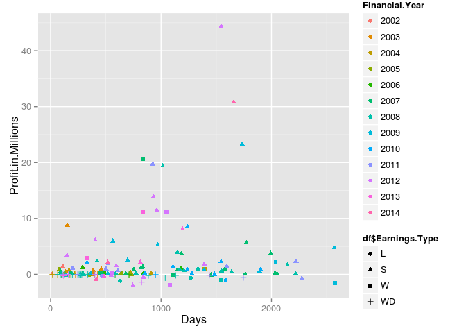
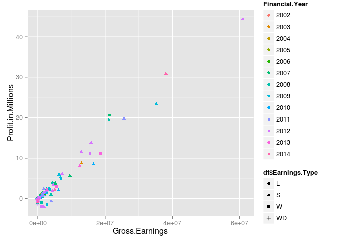
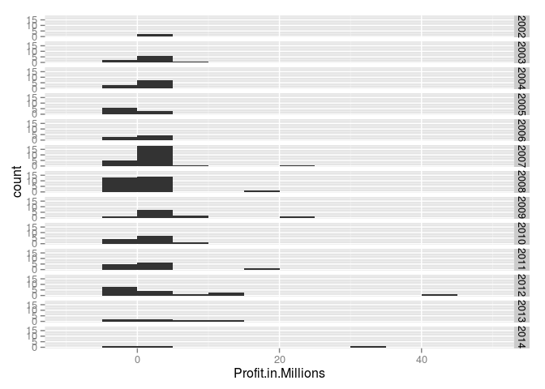
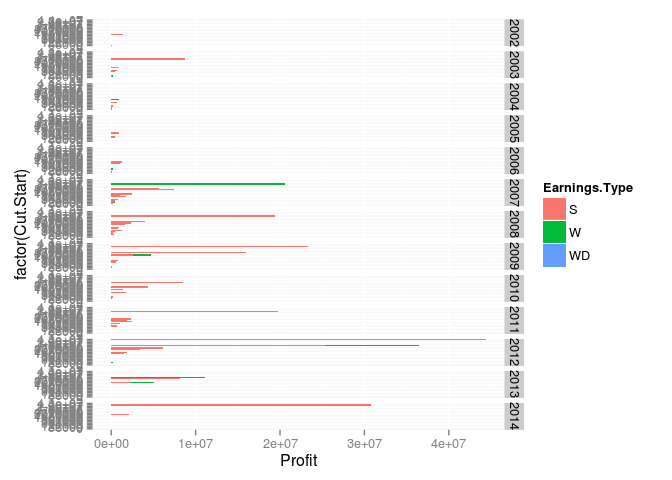
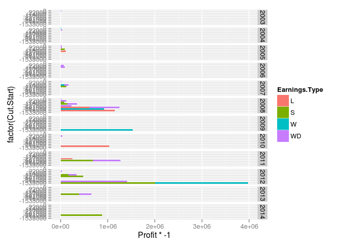
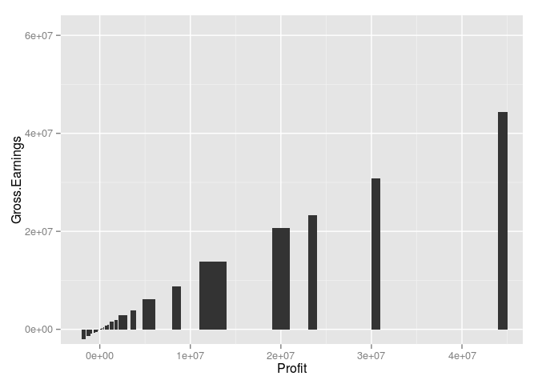
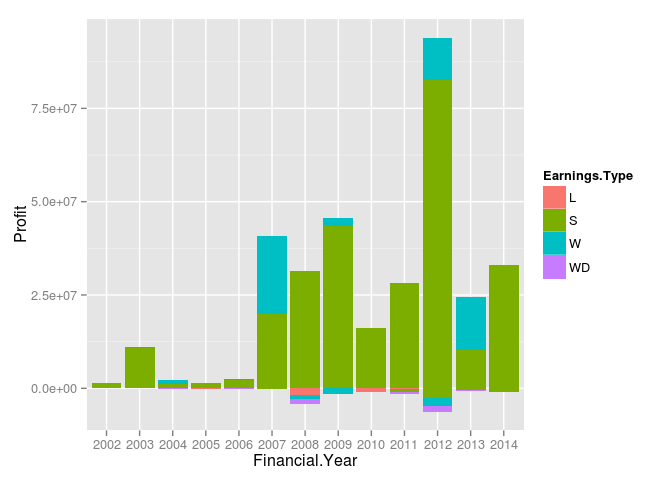
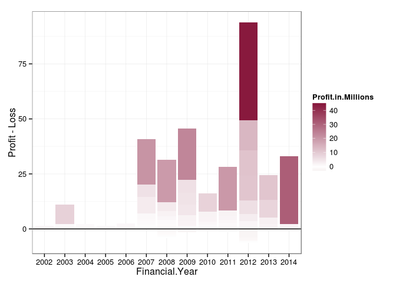
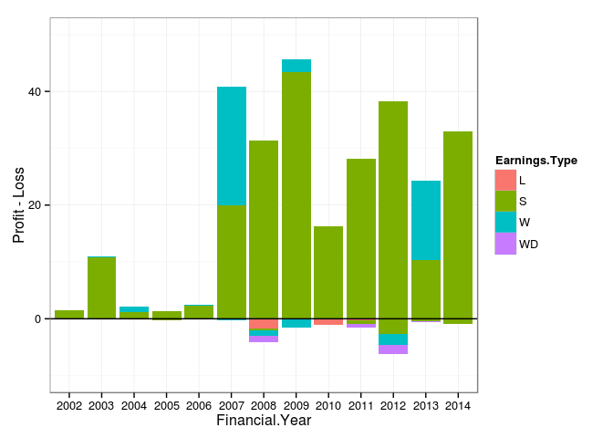

# Viz Examples


```r
require(ggplot2)
```

```
## Loading required package: ggplot2
```


```r
options(stringsAsFactors=F)
#require(plyr)
df=read.csv("20140805_Raw_Data.csv",stringsAsFactors=F) #legacy name
#df=(df[order(df$Profit.in.Millions),])
df$Profit.in.Millions=df$Profit/1e6
df$Opening.Date=as.Date(df$Opening.Date,"%d-%b-%y")
df$Withdrawl.Date=as.Date(df$Withdrawl.Date,"%d-%b-%y")
df$pl="P"
df$pl[df$Profit<=0]="L"
df$Financial.Year=factor(df$Financial.Year,levels=sort(unique(df$Financial.Year)))
str(df)
```

```
## 'data.frame':	151 obs. of  12 variables:
##  $ No                : int  116 4 48 36 82 53 64 117 118 1 ...
##  $ Opening.Date      : Date, format: "2000-01-16" "2001-08-20" ...
##  $ Withdrawl.Date    : Date, format: "2003-11-10" "2002-09-11" ...
##  $ Days              : int  1394 387 2032 2050 2220 2032 1993 713 726 385 ...
##  $ Financial.Year    : Factor w/ 13 levels "2002","2003",..: 3 2 6 6 7 6 6 3 3 2 ...
##  $ Earnings.Type     : chr  "W" "S" "S" "S" ...
##  $ Gross.Earnings    : num  1124717 60167 122890 214934 142032 ...
##  $ Profit            : num  958810 50334 67861 123367 129248 ...
##  $ Cut.Start         : num  901000 36000 36000 122000 122000 200000 3370000 0 200000 550000 ...
##  $ Cut.End           : num  1000000 101000 101000 200000 200000 300000 4000000 30000 300000 800000 ...
##  $ Profit.in.Millions: num  0.9588 0.0503 0.0679 0.1234 0.1292 ...
##  $ pl                : chr  "P" "P" "P" "P" ...
```
Let's see what we have, scatterplots first


```r
require(ggplot2)
require(scales)
```

```
## Loading required package: scales
```

```r
gscat=ggplot(df,aes(x=Days,y=Profit.in.Millions,color=Financial.Year,group=df$Earnings.Type))+geom_point(aes(shape=df$Earnings.Type))
print(gscat)
```

 

```r
gscat=ggplot(df,aes(x=Gross.Earnings,y=Profit.in.Millions,color=Financial.Year,group=df$Earnings.Type))+geom_point(aes(shape=df$Earnings.Type))
print(gscat)
```

 


```r
ghist=ggplot(df,aes(x=Profit.in.Millions)) + geom_histogram(binwidth=5)+facet_grid(Financial.Year~.)
print(ghist)
```

 


```r
df=df[order(df$Cut.Start,df$Earnings.Type),]
gbar=ggplot(df[df$Profit>0,],aes(x=factor(Cut.Start),y=Profit,fill=Earnings.Type))+geom_bar(stat="identity",)+facet_grid(Financial.Year~.)+coord_flip()
print(gbar)
```

 

```r
gbar=ggplot(df[df$Profit<=0,],aes(x=factor(Cut.Start),y=Profit*-1,fill=Earnings.Type))+geom_bar(stat="identity",)+facet_grid(Financial.Year~.)+coord_flip()
print(gbar)
```

 


```r
df$base=0
gspiffy=ggplot(df,aes(x=Profit,y=Gross.Earnings))+geom_rect(xmin=df$Cut.Start,xmax=df$Cut.End,ymin=df$base,ymax=df$Profit)
print(gspiffy)
```

 


```r
df=df[order(df$Financial.Year,df$Earnings.Type,df$Profit),]
gbb=ggplot(df,aes(x=Financial.Year))+
  geom_bar(data = subset(df, Profit>0),aes(y=Profit,fill=Earnings.Type),stat="identity")+
  geom_bar(data = subset(df, Profit<=0),aes(y=Profit,fill=Earnings.Type),stat="identity")
#scale_fill_gradient2(low = muted("red"),mid = "white", high = muted("black"), midpoint = 0,space = "rgb")
#facet_grid(Financial.Year~.)+coord_flip()
print(gbb)
```

```
## Warning: Stacking not well defined when ymin != 0
```

 


```r
df=df[order(df$Financial.Year,df$Profit),]
gbb=ggplot(df,aes(x=Financial.Year))+
  geom_bar(data = subset(df, pl=="P"),aes(y=Profit.in.Millions,fill=Profit.in.Millions),stat="identity")+
  geom_bar(data = subset(df, pl=="L"),aes(y=Profit.in.Millions,fill=Profit.in.Millions),stat="identity")+
   scale_y_continuous(labels = comma) +  theme_bw()+
  ylab("Profit - Loss") + 
  geom_hline(yintercept = 0,colour = "black") +
scale_fill_gradient2(low = muted("red"),mid = "white", high = muted("black"), midpoint = 0,space = "rgb")
print(gbb)
```

```
## Warning: Stacking not well defined when ymin != 0
```

 


```r
df=df[order(df$Financial.Year,df$Earnings.Type,df$pl),]
gbb3=ggplot(df,aes(x=Financial.Year))+
  geom_bar(data = subset(df, pl=="P"),aes(y=Profit.in.Millions,fill=Earnings.Type),stat="identity")+
  geom_bar(data = subset(df, pl=="L"),aes(y=Profit.in.Millions,fill=Earnings.Type),stat="identity")+
   scale_y_continuous(labels = comma, limits=c(-10,50)) +  theme_bw()+
  ylab("Profit - Loss") + 
  geom_hline(yintercept = 0,colour = "black") 
print(gbb3)
```

```
## Warning: Stacking not well defined when ymin != 0
```

 
